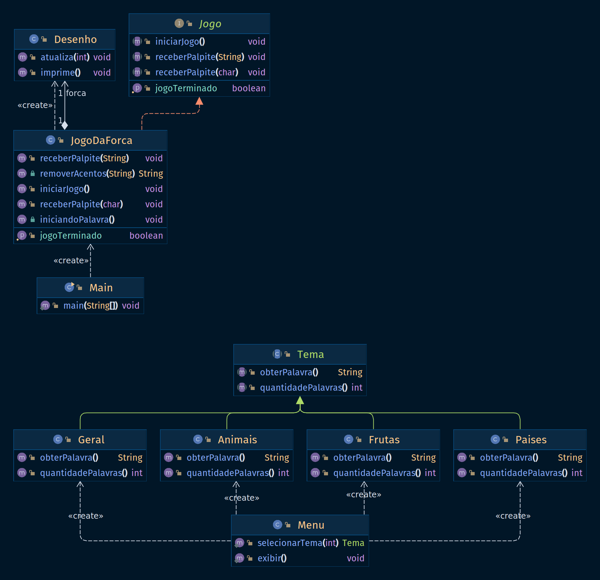

# Projeto Trilha POO - Jogo da Forca em Java

Este é um jogo da forca desenvolvido em Java, onde os jogadores podem escolher diferentes temas para jogar. O jogo apresenta uma palavra oculta que o jogador deve adivinhar, fornecendo letras como palpites ou tentando adivinhar a palavra completa. O jogador tem um número limitado de tentativas para adivinhar a palavra correta.

## Funcionalidades

- Escolha de temas: Os jogadores podem escolher entre diferentes temas, como animais, frutas, países, entre outros.
- Palavras ocultas: Cada tema contém uma lista de palavras ocultas relacionadas. O jogo seleciona aleatoriamente uma palavra do tema escolhido para que o jogador adivinhe.
- Feedback: O jogo fornece feedback ao jogador após cada tentativa, indicando se a letra fornecida está presente na palavra oculta.
- Limite de tentativas: O jogador tem um número máximo de tentativas para adivinhar a palavra correta. Se exceder o limite, o jogo termina.

## Pré-requisitos

- Java Development Kit (JDK): Certifique-se de ter o JDK versão 17 ou superior instalado e configurado corretamente na sua máquina.

## Diagrama de Classes

## Executando o jogo

1. Clone o repositório do projeto:  
https://github.com/ifpb-cz-ads/poo-2023-1-ai-AntonioMarcosDev.git
2. Navegue até o diretório do projeto;
3. Compile o código-fonte:
~~~bash
javac Main.java
~~~
4. Execute o jogo:
~~~bash
java Main
~~~
5. Siga as instruções exibidas no console para jogar a forca.
